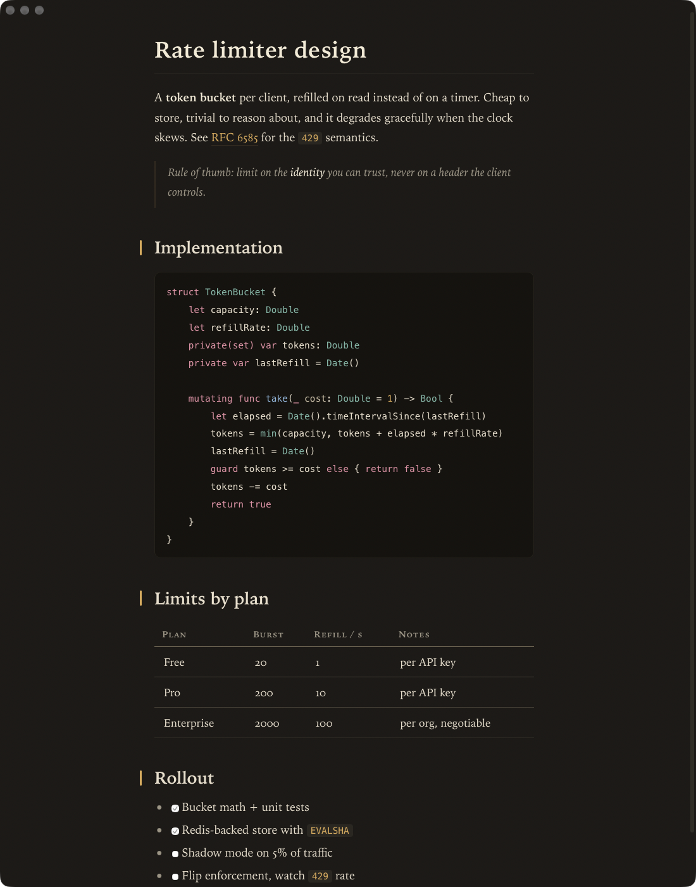
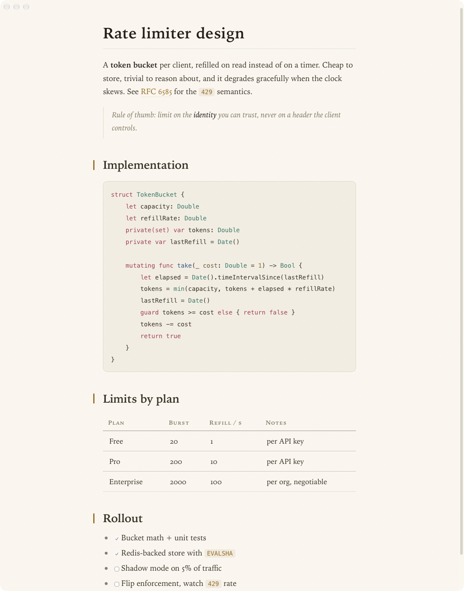
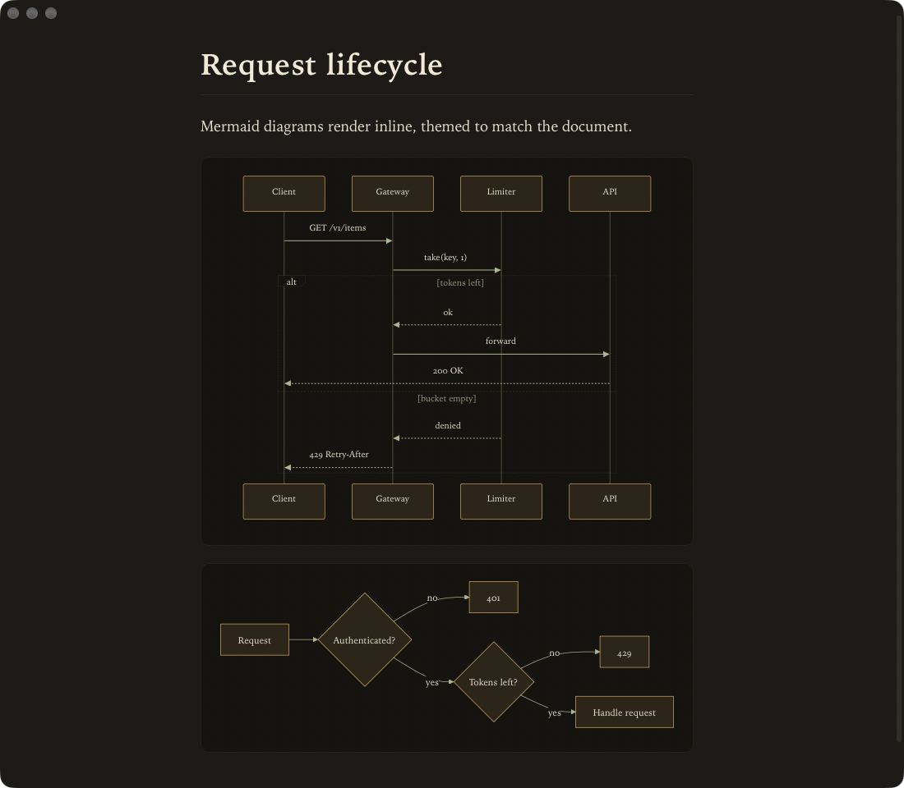
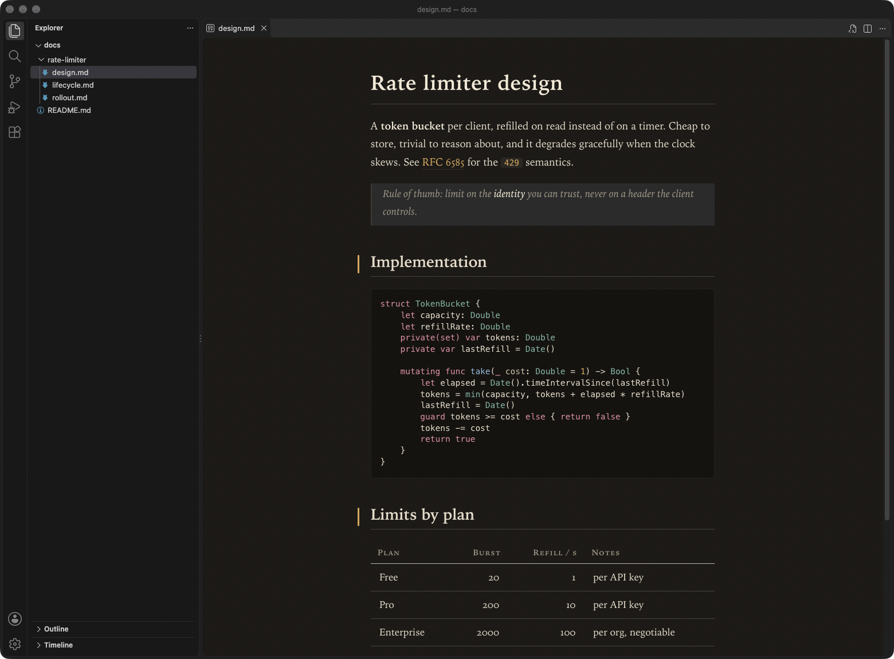

# MDReader

A native macOS markdown reader. Warm, typographic, keyboard-first, and fast: a
WKWebView in a plain `NSWindow`, no Electron.



| Light | Mermaid |
| --- | --- |
|  |  |

## Features

- GitHub-flavored markdown: tables, task lists, strikethrough, autolinks
- Syntax highlighting for ~40 languages, colored by role (keyword, type, function, string)
- Mermaid diagrams, themed to match the document
- Warm "reading lamp" dark theme and warm-paper light theme (`Cmd+Shift+D`)
- Live reload: the open file re-renders on save, keeping your scroll position
- Vim keys: `j`/`k`, `g`/`G`, `Ctrl+d`/`Ctrl+u`, `\` for the sidebar
- Address bar (`Cmd+L`) with back/forward history across local files, remote `.md`
  URLs, and GitHub blob links (rewritten to raw)
- Session restore, recent files, always-on-top (`t`), zoom that sticks
- Every shortcut listed in-app with `Cmd+/`

## Customize

Everything lives in `~/.config/mdreader/`:

- `theme.json`: partial theme override, merged on top of the active variant
- `keybindings.json`: rebind any action, e.g.
  `[{ "key": "j", "modifiers": ["control"], "action": "scrollDown" }]`

## VS Code extension

[`vscode-extension/`](vscode-extension/) brings the same look to VS Code's built-in
markdown preview. Its CSS is generated from the app's own theme
(`MDReader --dump-css`), so the two never drift apart.



## Build

Requires macOS 26, Xcode, [xcodegen](https://github.com/yonaskolb/XcodeGen) and
[mise](https://mise.jdx.dev).

```sh
mise run xcodegen
xcodebuild -scheme MDReader -configuration Debug CODE_SIGNING_ALLOWED=NO build
```

## License

MIT
