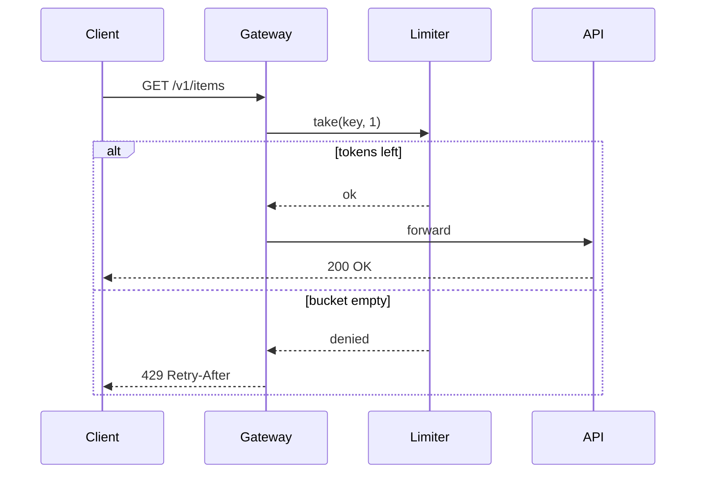
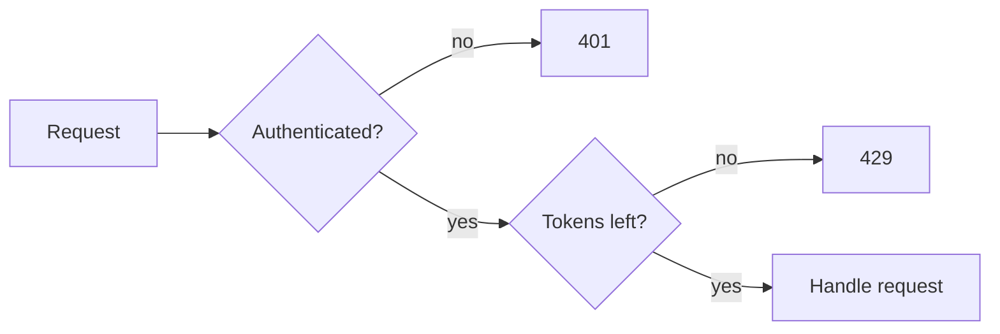

# Request lifecycle

Mermaid diagrams render inline, themed to match the document.

```mermaid
sequenceDiagram
    participant C as Client
    participant G as Gateway
    participant L as Limiter
    participant A as API
    C->>G: GET /v1/items
    G->>L: take(key, 1)
    alt tokens left
        L-->>G: ok
        G->>A: forward
        A-->>C: 200 OK
    else bucket empty
        L-->>G: denied
        G-->>C: 429 Retry-After
    end
```

```mermaid
flowchart LR
    A[Request] --> B{Authenticated?}
    B -- no --> C[401]
    B -- yes --> D{Tokens left?}
    D -- no --> E[429]
    D -- yes --> F[Handle request]
```
