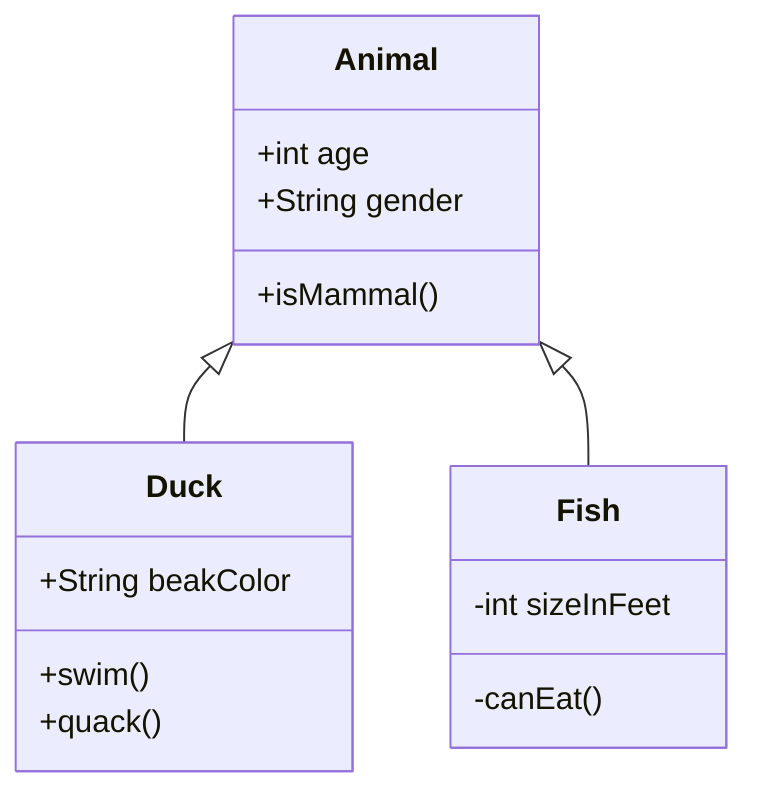
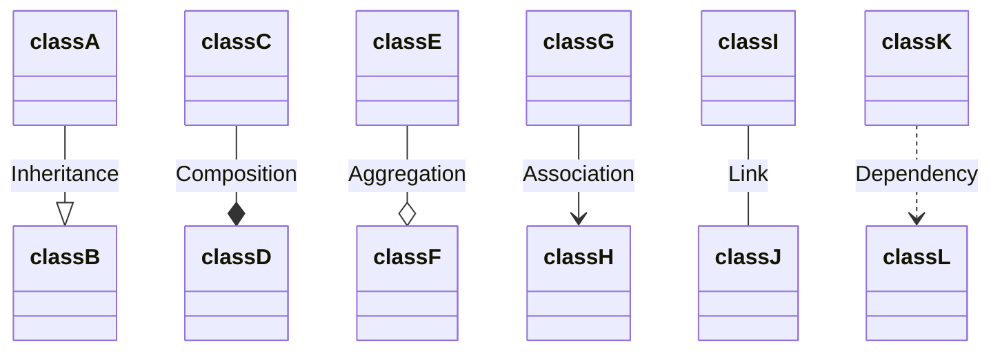

# Mermaid Class Diagram Samples

Examples adapted from https://mermaid.js.org/syntax/classDiagram.html to test diagram rendering.

## Basic

```mermaid
classDiagram
    Animal <|-- Duck
    Animal <|-- Fish
    Animal : +int age
    Animal : +String gender
    Animal: +isMammal()
    class Duck{
        +String beakColor
        +swim()
        +quack()
    }
    class Fish{
        -int sizeInFeet
        -canEat()
    }
```

## Relationship types

```mermaid
classDiagram
    classA --|> classB : Inheritance
    classC --* classD : Composition
    classE --o classF : Aggregation
    classG --> classH : Association
    classI -- classJ : Link
    classK ..> classL : Dependency
```
