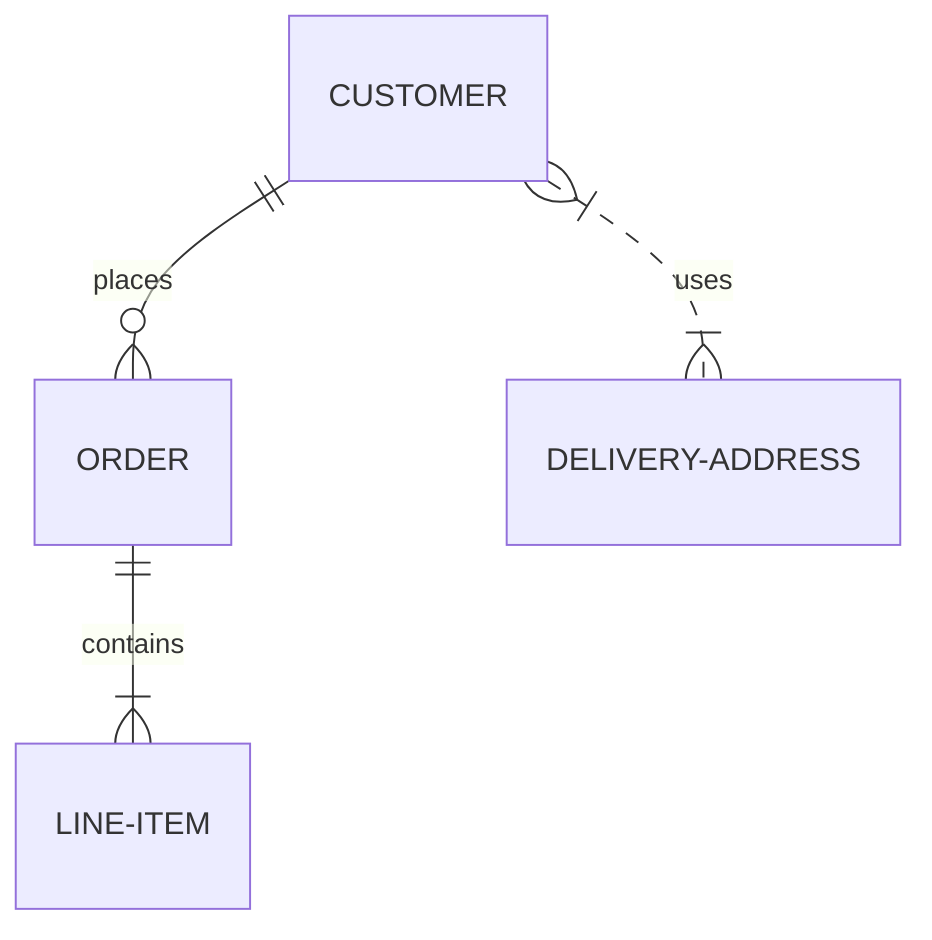
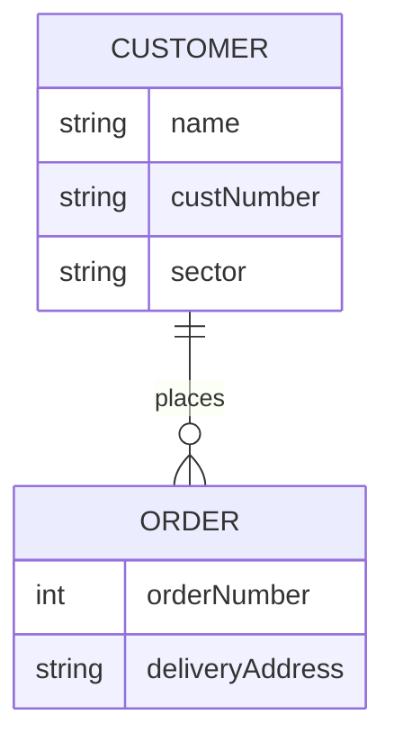

# Mermaid Entity Relationship Diagram Samples

Examples adapted from https://mermaid.js.org/syntax/entityRelationshipDiagram.html to test diagram rendering.

## Basic

```mermaid
erDiagram
    CUSTOMER ||--o{ ORDER : places
    ORDER ||--|{ LINE-ITEM : contains
    CUSTOMER }|..|{ DELIVERY-ADDRESS : uses
```

## With attributes

```mermaid
erDiagram
    CUSTOMER {
        string name
        string custNumber
        string sector
    }
    ORDER {
        int orderNumber
        string deliveryAddress
    }
    CUSTOMER ||--o{ ORDER : places
```
