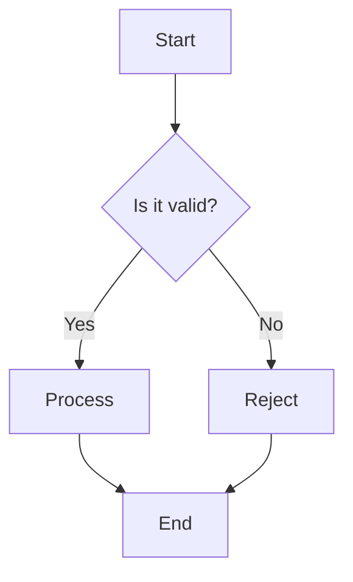
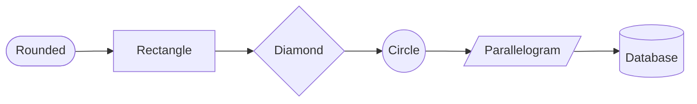
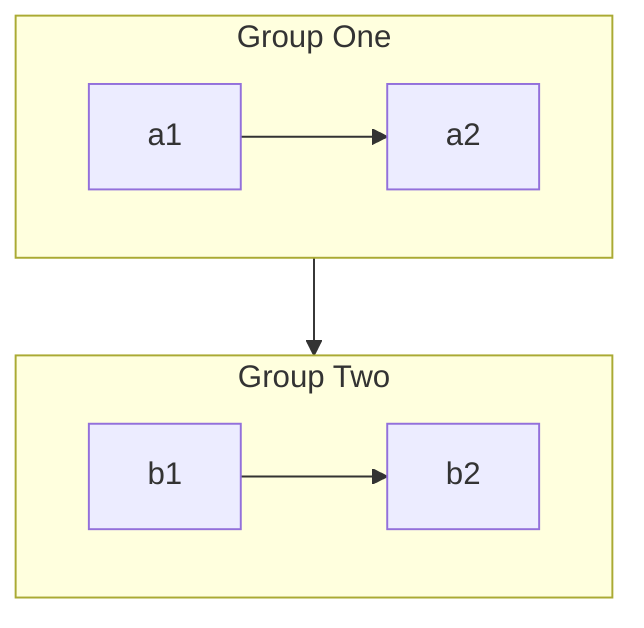

# Mermaid Flowchart Samples

Examples adapted from https://mermaid.js.org/syntax/flowchart.html to test diagram rendering.

## Basic

```mermaid
flowchart TD
    A[Start] --> B{Is it valid?}
    B -- Yes --> C[Process]
    B -- No --> D[Reject]
    C --> E[End]
    D --> E
```

## Node shapes

```mermaid
flowchart LR
    A([Rounded]) --> B[Rectangle]
    B --> C{Diamond}
    C --> D((Circle))
    D --> E[/Parallelogram/]
    E --> F[(Database)]
```

## Subgraphs

```mermaid
flowchart TB
    subgraph one[Group One]
        a1 --> a2
    end
    subgraph two[Group Two]
        b1 --> b2
    end
    one --> two
```
