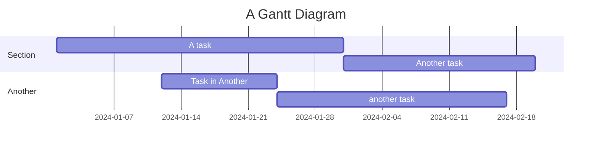
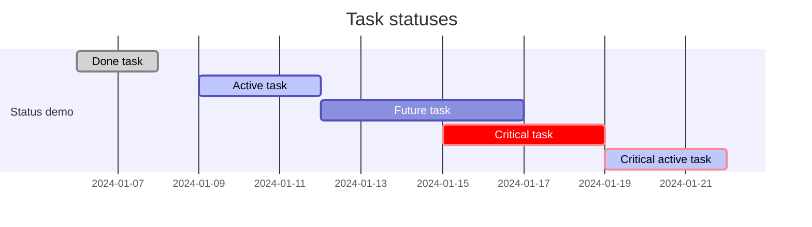

# Mermaid Gantt Chart Samples

Examples adapted from https://mermaid.js.org/syntax/gantt.html to test diagram rendering.

## Basic

```mermaid
gantt
    title A Gantt Diagram
    dateFormat YYYY-MM-DD
    section Section
        A task          :a1, 2024-01-01, 30d
        Another task    :after a1, 20d
    section Another
        Task in Another :2024-01-12, 12d
        another task    :24d
```

## Task statuses

```mermaid
gantt
    title Task statuses
    dateFormat YYYY-MM-DD
    section Status demo
        Done task               :done, des1, 2024-01-06, 2024-01-08
        Active task              :active, des2, 2024-01-09, 3d
        Future task               :des3, after des2, 5d
        Critical task            :crit, des4, 2024-01-15, 4d
        Critical active task    :crit, active, des5, after des4, 3d
```
