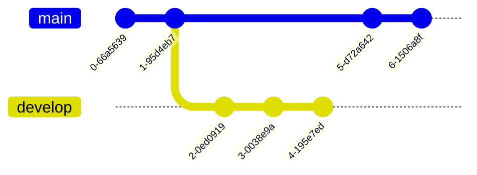
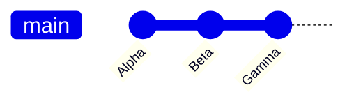
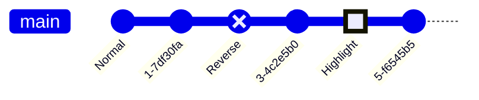
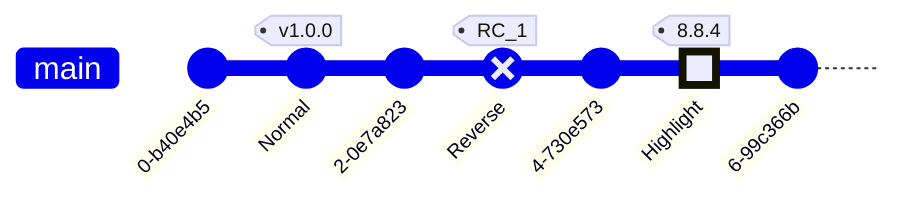
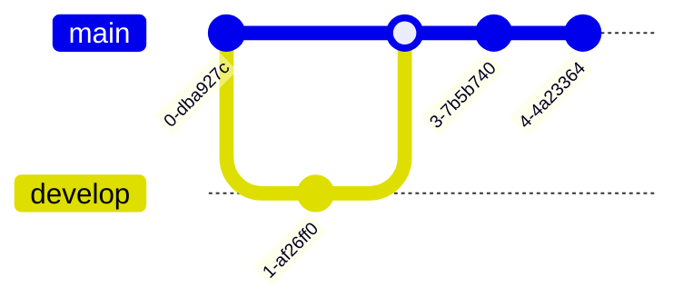
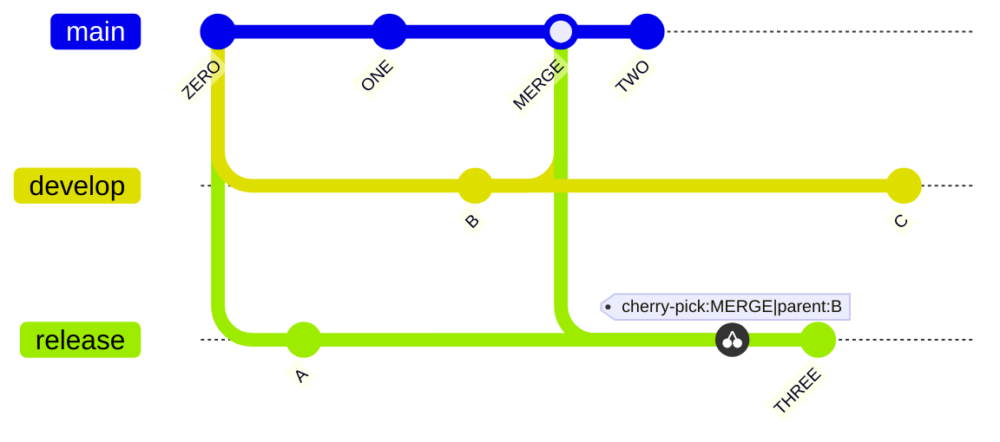
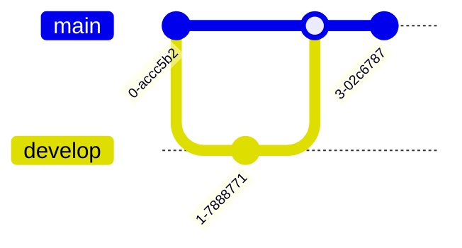
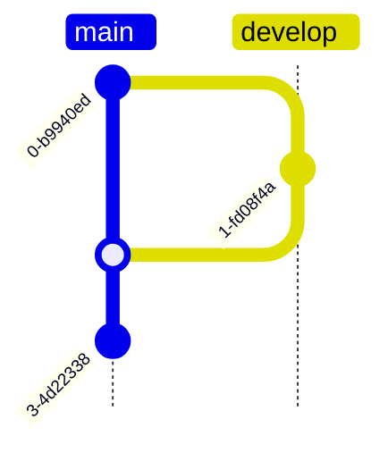

# Mermaid Gitgraph Samples

Examples adapted from https://mermaid.js.org/syntax/gitgraph.html to test diagram rendering.

## Basic

## Custom commit ids

## Commit types (normal / reverse / highlight)

## Tags

## Branches and merges

## Cherry-pick

## Orientation: left-to-right (default)

## Orientation: top-to-bottom

