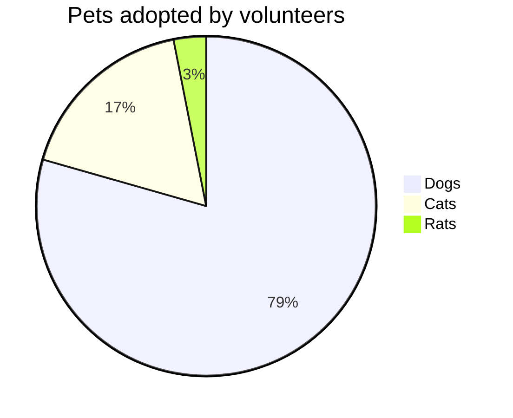
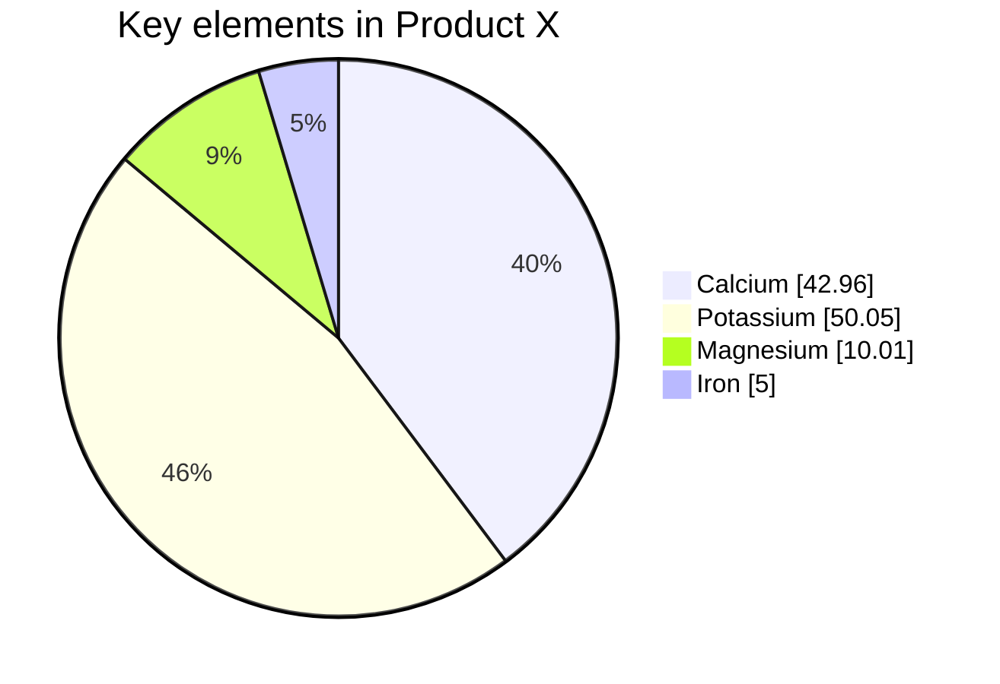

# Mermaid Pie Chart Samples

Examples adapted from https://mermaid.js.org/syntax/pie.html to test diagram rendering.

## Basic

```mermaid
pie title Pets adopted by volunteers
    "Dogs" : 386
    "Cats" : 85
    "Rats" : 15
```

## With showData

```mermaid
pie showData
    title Key elements in Product X
    "Calcium" : 42.96
    "Potassium" : 50.05
    "Magnesium" : 10.01
    "Iron" :  5
```
