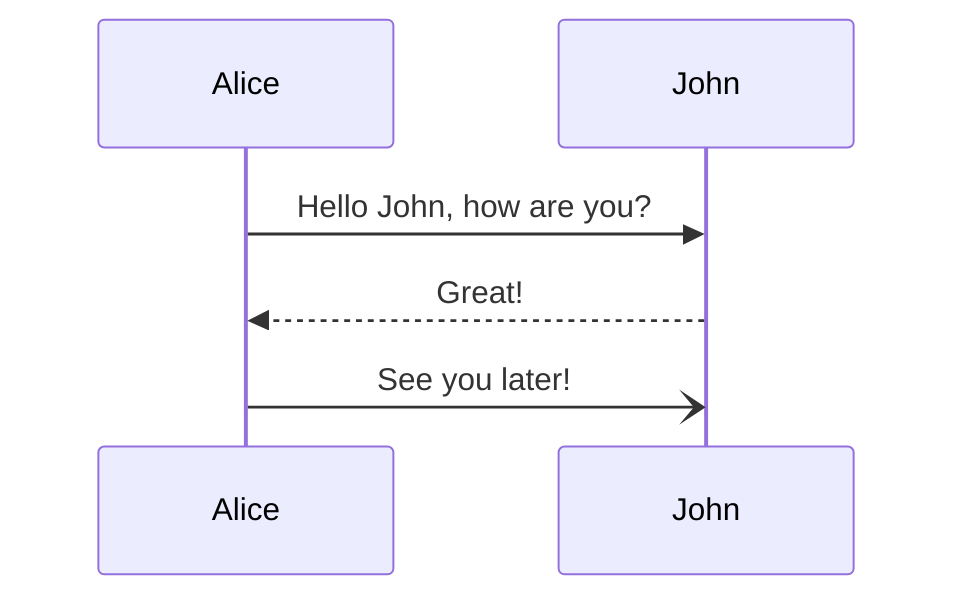
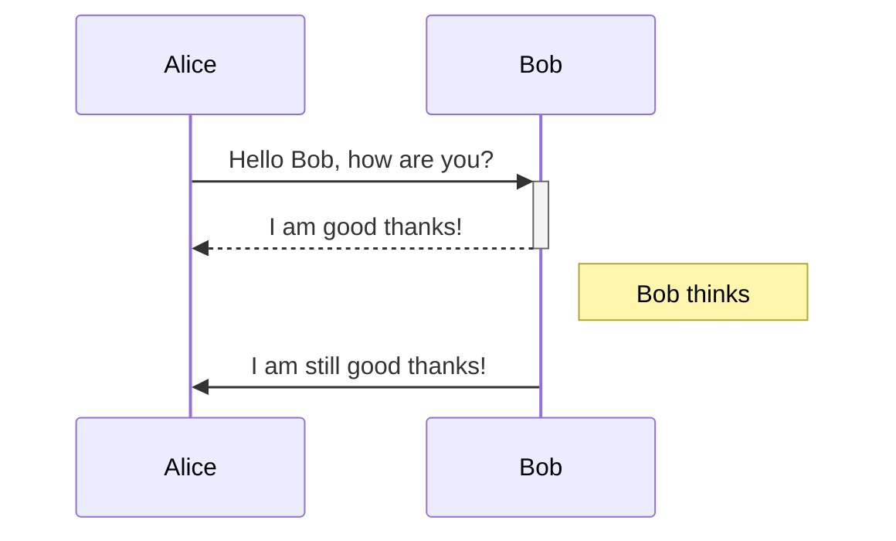
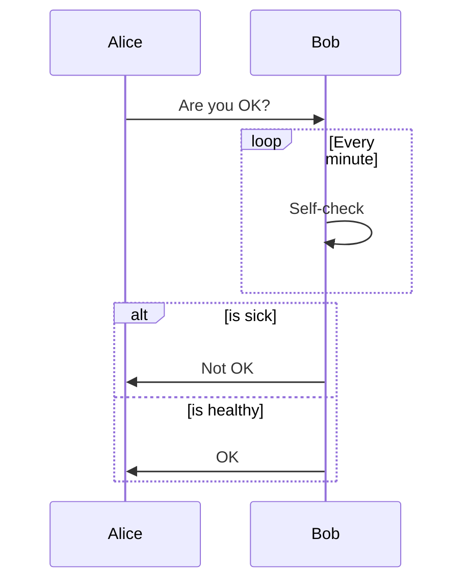

# Mermaid Sequence Diagram Samples

Examples adapted from https://mermaid.js.org/syntax/sequenceDiagram.html to test diagram rendering.

## Basic

## Activations and notes

## Loops and alternatives

