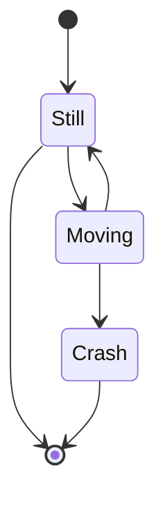
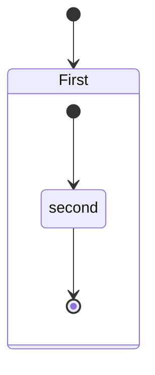
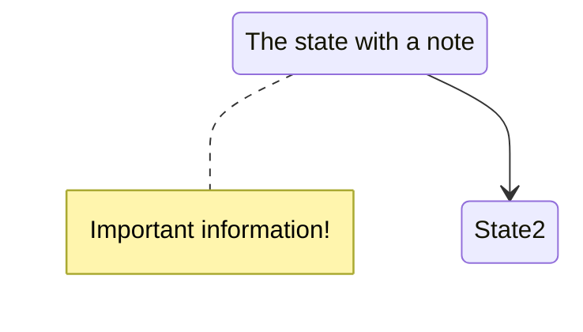

# Mermaid State Diagram Samples

Examples adapted from https://mermaid.js.org/syntax/stateDiagram.html to test diagram rendering.

## Basic

```mermaid
stateDiagram-v2
    [*] --> Still
    Still --> [*]
    Still --> Moving
    Moving --> Still
    Moving --> Crash
    Crash --> [*]
```

## Composite states

```mermaid
stateDiagram-v2
    [*] --> First
    state First {
        [*] --> second
        second --> [*]
    }
```

## Notes

```mermaid
stateDiagram-v2
    State1: The state with a note
    note right of State1
        Important information!
    end note
    State1 --> State2
```
